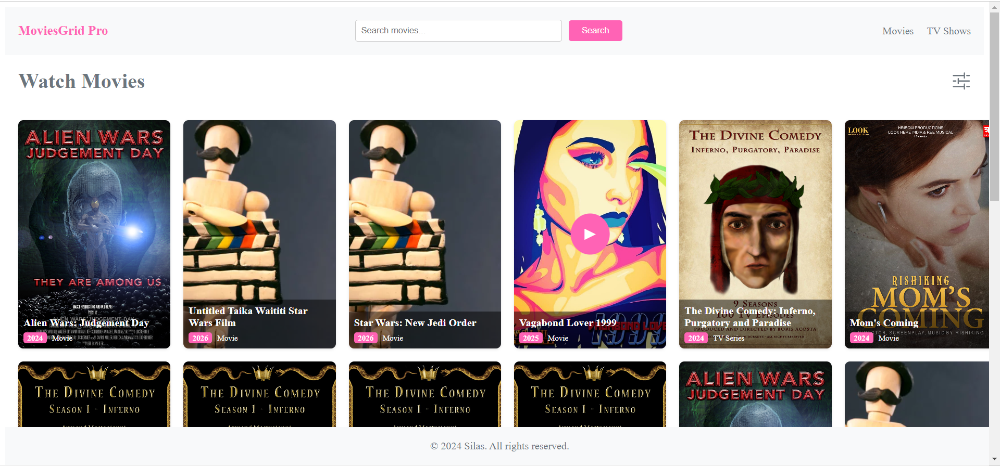

# MoviesGrid Pro


MoviesGrid Pro is a React application that allows users to browse movies and TV shows. It provides a grid layout for displaying movie posters along with title, release year, and type information. 
Loads/Fetch movies on scroll to bottom

## Features

- Display a grid of movie posters with title, release year, and type information.
- Pagination support for loading more movies as Users scroll to the bottom of the page.
- Click on a movie to view more details.
- Search functionality to find specific movies.
- Responsive design for seamless experience on different devices.

## Installation

1. Clone the repository:

   ```bash
   git clone <repository-url>

2. cd movies

3. npm install
4. npm run dev


## Technologies Used

- React
- Axios
- CSS (for styling)